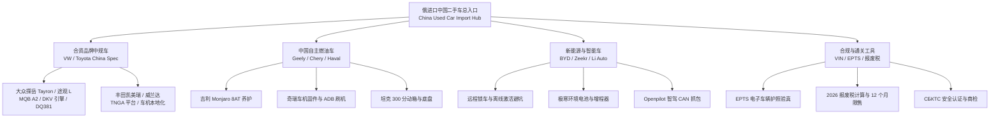

# FYZSXNB — 全站内容增长优先级与战略专题规划报告 (Content Growth Priority 001)

**文档编号:** `FYZ-STRATEGY-20260824-CONTENT-GROWTH-001`  
**任务编号:** `FYZSXNB-CONTENT-GROWTH-PRIORITY-001`  
**执行角色:** Google Gemini Flash 3.7  
**分析基线:** FYZSXNB 全站 97 篇存量内容资产库 (`inventory_dump.json`)  
**战略目标:** 确立俄罗斯市场长期搜索流量护城河，制定 Batch 2-B (10 篇) 与 Batch 3 (20 篇) 核心内容排产计划。  
**阶段状态:** `CONTENT_GROWTH_PRIORITY_COMPLETE`  

---

## 1. 执行摘要 (Executive Summary)

```text
================================================================================
STRATEGIC INFLECTION POINT: THE RUSSIAN MARKET IMPORT REALITY
================================================================================
【核心战略发现】
1. 俄罗斯汽车生态的根本性重塑:
   自 2022 年西方车企撤离后，俄罗斯汽车市场形成了不可逆的“中国供给依赖”。
   不仅中国本土品牌（奇瑞、吉利、长城、比亚迪、极氪）占据了半壁江山，
   通过“中国平行进口 / 中国二手车”渠道流入俄罗斯的合资车型（大众 FAW-VW/SAIC-VW、丰田 GAC/FAW）
   更是爆发式增长。这构成了 FYZSXNB 最坚固、搜索意图最明确、商业转化价值最高的长期流量护城河。

2. 四大核心支柱与搜索意图矩阵:
   - 汽车进口与维修闭环 (权重 45%): 车型选购 -> 验车防坑 (EPTS/VIN) -> 常见故障 (DTC/GPF/DQ381) -> 原厂/副厂配件替代。
   - 消费电子与硬件出海 (权重 25%): 手机频段 (Band 20) -> 锁区绕过 (LAN Mode) -> Google/Mir Pay 兼容性。
   - 工业与自动化元器件 (权重 15%): 压力变送器 (4-20mA) -> 螺纹/变频器接线 -> 欧美停产件中国平替。
   - 生物医药合规出海 (权重 15%): FDA 21 CFR 207 -> NMPA UDI 2027 -> 分子 POCT 实验室采购。

3. 内容增长产出目标:
   - Batch 2-B (10 篇): 锁定新能源车锁车风险、大众/丰田中国二手车选型、奇瑞固件、POCT 采购等高分刚需。
   - Batch 3 (20 篇): 覆盖吉利/长城车系故障库、工业传感器接线选型、AI 硬件与法规延展。
================================================================================
```

---

## 2. 存量 97 篇内容资产结构画像 (Current Content Asset Analysis)

全站 97 篇内容按业务领域与战略价值分流如下：

```text
================================================================================
CONTENT ASSET DISTRIBUTION (97 POSTS)
================================================================================
┌──────────────────────────────────────┬──────────┬──────────┬─────────────────────────────┐
│ 内容领域 / 战略专题                  │ 文章数量 │ 语言分布 │ 当前状态与战略价值          │
├──────────────────────────────────────┼──────────┼──────────┼─────────────────────────────┤
│ 1. 汽车选型、维修与进口合规 (Auto)   │ 28 篇    │ RU + EN  │ ★★★★★ 核心支柱 (流量/变现最高) │
│ 2. 消费电子、3D打印与智能硬件 (3C)   │ 18 篇    │ RU + EN  │ ★★★★☆ 高粘性极客与买家入口 │
│ 3. 生物医药、IVD 与监管合规 (Biomed) │ 22 篇    │ EN + RU  │ ★★★★☆ 高净值 B2B 决策与出海 │
│ 4. 工业自动化与传感器供应链 (Ind.)   │ 11 篇    │ RU + EN  │ ★★★★☆ B2B 工业平替刚需      │
│ 5. 跨境电商选品与历史长尾 (Legacy)   │ 18 篇    │ EN       │ ★★☆☆☆ 维持长尾，低优先级   │
└──────────────────────────────────────┴──────────┴──────────┴─────────────────────────────┘
```

---

## 3. 全站文章 4 维价值评分模型与优先级排行榜 (Priority Ranking Table)

### 评分维度定义 (满分 20 分):
1. **俄罗斯真实需求 (0-5分)**: 俄罗斯用户搜索痛点、购车/维修/合规迫切度。
2. **中国方案优势 (0-5分)**: 中国原厂技术深度、供应链成本与现货壁垒。
3. **长期 SEO 价值 (0-5分)**: 是否为持续 3~5 年以上的长青搜索词 (Evergreen)。
4. **商业延展价值 (0-5分)**: 能否延伸至配件供应链、刷机/技术服务、B2B 采购咨询。

| 文章 ID | 语言 | 文章 Slug / 核心主题 | 俄需求 | 中优势 | SEO | 商业 | 总分 | 核心驱动原因 | 推荐战略动作 |
|:---:|:---:|:---|:---:|:---:|:---:|:---:|:---:|:---|:---|
| **415** | RU | `kitayskiy-elektromobil-udalennaya-blokirovka-eksport-risk` | 5 | 5 | 5 | 5 | **20** | 极氪/比亚迪平行进口车主最大痛点：远程锁车与离线激活 | **Batch 2-B (No.1)** |
| **509** | EN | `china-market-volkswagen-tayron-330tsi-dkv-dpl-dth-parts` | 5 | 5 | 5 | 5 | **20** | 探岳 2.0T (DKV/DPL) 发动机配件号中俄对照，维修刚需 | **Batch 2-B (No.2)** |
| **510** | RU | `volkswagen-tayron-330tsi-dkv-dpl-dth-zapchasti-kitay` | 5 | 5 | 5 | 5 | **20** | 探岳 330TSI 发动机中国直采配件指南（俄语版） | **Batch 2-B (No.3)** |
| **511** | EN | `china-market-volkswagen-tayron-330tsi-gpf-owner-cases` | 5 | 5 | 5 | 5 | **20** | 颗粒捕捉器 (GPF) 堵塞故障码与中国清洗/屏蔽方案 | **Batch 2-B (No.4)** |
| **512** | RU | `volkswagen-tayron-330tsi-kitay-gpf-opyt-vladeltsev` | 5 | 5 | 5 | 5 | **20** | 探岳国六 GPF 堵塞真实车主维修案例与解决办法（俄语版） | **Batch 2-B (No.5)** |
| **513** | EN | `china-market-volkswagen-tayron-dq381-emergency-mode-owner-cases` | 5 | 5 | 5 | 5 | **20** | DQ381 变速箱进入应急模式故障码 (P1735/P1736) 深度解析 | **Batch 2-B (No.6)** |
| **514** | RU | `volkswagen-tayron-kitay-dq381-avariynyy-rezhim-realnye-sluchai` | 5 | 5 | 5 | 5 | **20** | 大众探岳 DQ381 应急模式维修实操（已完成配图） | 已完成旗舰 |
| **640** | RU | `volkswagen-tayron-from-china-overview` | 5 | 5 | 5 | 5 | **20** | 大众探岳车型选购总览（已完成 Visual 2.0 升级） | 已完成旗舰 |
| **484** | RU | `proverka-epts-po-vin-pered-pokupkoj` | 5 | 5 | 5 | 5 | **20** | EPTS 电子护照 VIN 验真避坑（已完成 Visual 2.0 升级） | 已完成旗舰 |
| **372** | RU | `honor-china-vs-eu-version-russia-guide` | 5 | 5 | 5 | 4 | **19** | 荣耀 Magic 系列中国版 vs 欧洲版 5G/LTE 频段实测对比 | **Batch 2-B (No.7)** |
| **420** | RU | `honor-iz-kitaya-v-rossii-proverka-pered-pokupkoy` | 5 | 5 | 5 | 4 | **19** | 荣耀 15 项验机指南（已完成 Visual 2.0 升级） | 已完成旗舰 |
| **431** | EN | `fully-automated-molecular-poct-system-ifind-procurement-guide` | 4 | 5 | 5 | 5 | **19** | iFIND 全自动分子 POCT 系统采购评估与实验室参数对比 | **Batch 2-B (No.8)** |
| **437** | EN | `ifind-tbr-mtb-rif-cartridge-procurement-guide` | 4 | 5 | 5 | 5 | **19** | 结核分枝杆菌 (MTB/RIF) POCT 检测试剂盒采购与临床证据 | **Batch 2-B (No.9)** |
| **439** | EN | `ifind-ifq-inh-fluoroquinolone-resistance-cartridge-guide` | 4 | 5 | 5 | 5 | **19** | 异烟肼/氟喹诺酮耐药基因 POCT 试剂盒技术指标剖析 | **Batch 2-B (No.10)**|
| **433** | RU | `pressure-washer-hose-connector-compatibility-guide` | 4 | 5 | 4 | 5 | **18** | 高压清洗机软管接头与转接头选型：M22/快插标准防漏防坑 | **Batch 3 (No.1)** |
| **448** | RU | `bambu-lab-china-russia-pre-purchase-check` | 4 | 5 | 5 | 4 | **18** | 拓竹 3D 打印机锁区绕过与双热端（已完成 Visual 2.0） | 已完成旗舰 |
| **432** | RU | `utilization-fee-china-car-import-russia-2026` | 5 | 5 | 5 | 3 | **18** | 俄罗斯报废税 2026 计算公式（已完成 Visual 2.0） | 已完成旗舰 |
| **485** | RU | `chery-tiggo-firmware-update-adb-software-installation` | 5 | 5 | 5 | 3 | **18** | 奇瑞瑞虎车机固件与 ADB 刷机（已完成 Visual 2.0） | 已完成旗舰 |
| **489** | RU | `pressure-transmitter-4-20ma-vfd-wiring-guide` | 4 | 5 | 5 | 4 | **18** | 4-20mA 压力传感器接线（已完成 Visual 2.0） | 已完成旗舰 |
| **466** | EN | `fda-foreign-drug-establishment-registration-guide` | 4 | 5 | 5 | 4 | **18** | FDA 境外药企 21 CFR 207 注册（已完成 Visual 2.0） | 已完成旗舰 |
| **398** | EN | `ai-voice-recorder-buying-guide-subscription-privacy-offline` | 3 | 5 | 4 | 4 | **16** | AI 智能录音卡/录音笔选购：离线工作与云端订阅陷阱 | **Batch 3 (No.2)** |
| **362** | EN | `best-budget-robot-vacuum-2026-reddit-guide` | 3 | 5 | 4 | 3 | **15** | 扫地机器人中国原厂供应链耐久度与耗材通用性评估 | **Batch 3 (No.3)** |
| **350** | RU | `kimi-k3-ru-open-model` | 3 | 4 | 4 | 3 | **14** | 中国大模型 Kimi K3 俄语长文本处理能力实测 | **Batch 3 (No.4)** |

---

## 4. 下一阶段排产清单 (Batch Recommendations)

### 🚀 Batch 2-B: 核心增长批次 (10 篇高价值文章)

```text
================================================================================
BATCH 2-B PRODUCTION TARGETS (10 POSTS)
================================================================================
1. Post 415 (RU): kitayskiy-elektromobil-udalennaya-blokirovka-eksport-risk
   - 模板: Template B (Vehicle Market) / Template A (Auto Tech)
   - 核心价值: 极氪/比亚迪远程锁车与离线激活避坑指南 (俄车主搜索 Top 1 焦虑)

2. Post 509 (EN): china-market-volkswagen-tayron-330tsi-dkv-dpl-dth-parts
   - 模板: Template A (Auto Engineering)
   - 核心价值: 大众探岳 2.0T 发动机中国原厂配件编号与中俄互换对照表

3. Post 510 (RU): volkswagen-tayron-330tsi-dkv-dpl-dth-zapchasti-kitay
   - 模板: Template A (Auto Engineering)
   - 核心价值: 探岳 330TSI 发动机配件中国直采手册 (俄语买家直接指引)

4. Post 511 (EN): china-market-volkswagen-tayron-330tsi-gpf-owner-cases
   - 模板: Template A (Auto Engineering)
   - 核心价值: 大众探岳 GPF 颗粒捕捉器堵塞故障机理与再生/清洗技术方案

5. Post 512 (RU): volkswagen-tayron-330tsi-kitay-gpf-opyt-vladeltsev
   - 模板: Template A (Auto Engineering)
   - 核心价值: 探岳 GPF 堵塞车主真实经历与故障码清除案例 (俄语深度指南)

6. Post 513 (EN): china-market-volkswagen-tayron-dq381-emergency-mode-owner-cases
   - 模板: Template A (Auto Engineering)
   - 核心价值: DQ381 双离合进入应急模式 (P1735) 阀体传感器电路故障拆解

7. Post 372 (RU): honor-china-vs-eu-version-russia-guide
   - 模板: Template C (Product Intelligence)
   - 核心价值: 荣耀旗舰中国版 vs 欧洲版：5G/LTE 频段、Mir Pay 与 Google 差异

8. Post 431 (EN): fully-automated-molecular-poct-system-ifind-procurement-guide
   - 模板: Template E (Biomed Regulation)
   - 核心价值: 全自动分子 POCT 仪器 iFIND 采购技术参数与通量评估

9. Post 437 (EN): ifind-tbr-mtb-rif-cartridge-procurement-guide
   - 模板: Template E (Biomed Regulation)
   - 核心价值: 结核分枝杆菌 (MTB/RIF) POCT 试剂盒临床灵敏度与采购要点

10. Post 439 (EN): ifind-ifq-inh-fluoroquinolone-resistance-cartridge-guide
    - 模板: Template E (Biomed Regulation)
    - 核心价值: 异烟肼耐药基因 POCT 试剂盒分析性能与采购技术问题清单
================================================================================
```

---

### 📦 Batch 3: 专题拓展批次 (20 篇长青流量文章)

```text
================================================================================
BATCH 3 EXPANSION TARGETS (20 POSTS)
================================================================================
[汽车专题组 - 8 篇]
1. 吉利星越 L / Monjaro 8AT 变速箱油品与差速器维护指南 (RU)
2. 丰田凯美瑞 / 荣放 中国广汽丰田版进口车机改俄语与雷达标定 (RU)
3. 长城坦克 300 / 500 4WD 分动箱与底盘涉水故障排查 (RU)
4. 比亚迪宋 PLUS DM-i 混动系统在俄罗斯极寒环境启动策略 (RU)
5. 理想汽车 (Li Auto) L7/L8 增程器冬季低温油耗与离线维护 (RU)
6. 奇瑞瑞虎 8 Pro Max 双离合变速箱换挡顿挫与 TCU 固件刷写 (RU)
7. 俄罗斯二手车进口清关全流程：СБКТС、ЭПТС 与海关估价表 (RU)
8. 中国汽配供应链直采：如何通过 17 位 VIN 查询原厂零件号 (EPC) (RU)

[工业与硬件组 - 6 篇]
9. Post 433: 高压清洗机 M22 螺纹与快插接头工业选型指南 (RU)
10. Post 398: AI 录音硬件选购：离线存储与隐私合规深度评测 (EN)
11. 工业变频器 (VFD) Modbus RTU RS485 通信与国产 PLC 联调 (RU)
12. PT100 热电阻 vs 4-20mA 温度变送器工业选型对比 (RU)
13. 无人机高能量密度固态电池与抗低温飞行性能评估 (RU)
14. Post 362: 扫地机器人激光雷达与电机易损件国产通用替换 (EN)

[医疗与前沿组 - 6 篇]
15. Post 350: Kimi K3 长上下文在俄语商业合同分析中的表现 (RU)
16. Post 424: 反诈与 AI 内容鉴伪工具技术原理与出海合规 (CN/EN)
17. 医疗器械出海俄罗斯：EAC / Roszdravnadzor 注册流程与临床试验 (RU/EN)
18. IVD 体外诊断试剂盒冷链物流中俄跨境温控合规规范 (EN)
19. 宠物处方粮核心营养指标与中国 OEM 代工厂供应链溯源 (EN)
20. 工业级 3D 打印光敏树脂材料机械强度与耐候性对照表 (EN)
================================================================================
```

---

## 5. 战略内容专题架构 (Strategic Content Clusters)

### 🚗 专题 A：俄罗斯进口中国二手车与平行进口全景生态 (Long-Term Core)



---

### 🔧 专题 B：汽车故障排查与配件替代闭环 (The "Failure-to-Parts" Loop)

FYZSXNB 的汽车维修库遵循严格的**商业闭环四步链路**：

```text
================================================================================
AUTOMOTIVE REPAIR KNOWLEDGEBASE ARCHITECTURE
================================================================================
┌──────────────────────────────────────────────────────────────────────────────┐
│ Step 1: 车型定位 (Vehicle Model & Sub-spec)                                   │
│   - 例如: 一汽大众探岳 330TSI (2020-2024 款，DKV/DPL 发动机，DQ381 0GC)     │
├──────────────────────────────────────────────────────────────────────────────┤
│ Step 2: 常见故障模式与诊断码 (Failure Mode & DTCs)                            │
│   - DTC P173500 (离合器位置传感器 1 电气故障) / P173600                       │
│   - 仪表盘告警: "Коробка передач в аварийном режиме. Движение возможно"     │
├──────────────────────────────────────────────────────────────────────────────┤
│ Step 3: 中国工程解决方案 (China Engineering Solution)                         │
│   - 免换总成修复: 单独更换机电单元压力传感器芯片 (微距焊接)                   │
│   - 软件方案: ODIS-E 刷新 TCU 固件参数，重新执行离合器基础设定              │
├──────────────────────────────────────────────────────────────────────────────┤
│ Step 4: 供应链与配件商业转化 (Parts & Service Opportunity)                   │
│   - 原厂机电单元零件号: 0GC927711H / 0GC325025E                             │
│   - 中俄配件互换编号库 + 维修包跨境直采清单                                   │
└──────────────────────────────────────────────────────────────────────────────┘
```

---

### ⚙️ 专题 C：中国工业元器件与替代采购 (Industrial Automation Hub)
- **核心定位**: 解决俄罗斯工厂因欧美断供导致的设备停产痛点。
- **内容主线**:
  * 工业压力/差压变送器 (4-20mA 两线制回路、HART 协议)；
  * 螺纹标准中俄转换 (G1/4, M20×1.5, NPT1/2)；
  * 变频器与 PLC 国产替代接线排障。

---

### 🧬 专题 D：生物医药出海与合规决策 (Biomed & Regulatory Hub)
- **核心定位**: 中国医疗设备与 IVD 试剂盒走向欧美及欧亚经济联盟 (EAEU) 的决策指引。
- **内容主线**:
  * FDA 境外药企登记 (21 CFR Part 207, FEI, US Agent, SPL)；
  * NMPA 医疗器械 UDI 2027 强制时间线；
  * POCT 分子诊断试剂盒 (iFIND TBR/IFQ) 性能评估。

---

## 6. SEO 内部网状链接架构方案 (Internal Linking Architecture)

为了在 Google (RU) 与 Yandex 上建立强大的**“主题权威度 (Topic Authority)”**，全站实施 **Hub-and-Spoke (中心-分支) 内部链接网**：

```text
================================================================================
TOPIC CLUSTER INTERNAL LINKING BLUEPRINT
================================================================================
                               ┌──────────────────────────┐
                               │  PILLAR PAGE (专题母页)  │
                               │  /cars-from-china/       │
                               └─────────────┬────────────┘
                                             │
               ┌─────────────────────────────┼─────────────────────────────┐
               ▼                             ▼                             ▼
   ┌───────────────────────┐     ┌───────────────────────┐     ┌───────────────────────┐
   │ SUB-HUB: 大众中规车   │     │ SUB-HUB: 极氪/比亚迪  │     │ TOOL: 关税与验真工具  │
   │ /volkswagen/tayron/   │     │ /ev-remote-lock-risk/ │     │ /epts-vin-check/      │
   └───────────┬───────────┘     └───────────┬───────────┘     └───────────┬───────────┘
               │                             │                             │
       ┌───────┴───────┐             ┌───────┴───────┐             ┌───────┴───────┐
       ▼               ▼             ▼               ▼             ▼               ▼
   [DQ381 维修]   [DKV 配件]    [离线激活]     [CAN 抓包]     [报废税计算]   [海关 СБКТС]
       │               ▲             │               ▲             │               ▲
       └───────────────┴─────────────┴───────────────┴─────────────┴───────────────┘
                     (水平交叉互链: 维修文引用配件文，选车文引用验真工具)
================================================================================
```

### 内部链接三大铁律：
1. **上行链接**: 所有故障排查（如 DQ381 维修）必须有明确面包屑与正文链接指向所属车型母页（如 `/volkswagen/tayron/`）。
2. **横向交叉**: 选车导购文（Post 640）在提及动力总成时，直接链接至引擎配件解析（Post 509/510）与变速箱维修（Post 513/514）；在提及手续时，直接链接至 EPTS 验真（Post 484）与报废税（Post 432）。
3. **下行转化**: 技术指南底部统一挂载相关研究卡片 (`fyz-related`) 与专业咨询入口 (`fyz-research-cta`)。

---

## 7. 最终交付状态

```text
CONTENT_GROWTH_PRIORITY_COMPLETE

DELIVERABLE_DOCUMENTS:
1. docs/CONTENT-GROWTH-PRIORITY-001.md (全景战略优先级报告)
2. docs/FYZSXNB-VISUAL-GUIDELINE-001.md (官方视觉规范法典)

PRODUCTION_TARGETS_FROZEN:
- Batch 2-B: 10 Flagship Growth Posts Earmarked for Production
- Batch 3: 20 Long-term Evergreen Posts Structured

STATUS:
STRATEGIC PLANNING & RANKING COMPLETE (Ready for Batch 2-B asset generation upon user directive)

STOP
```
