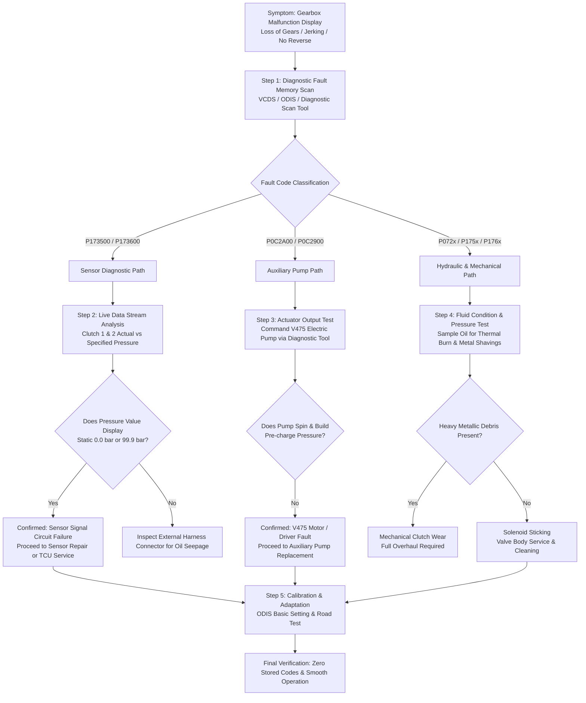

# Volkswagen Tayron DQ381 DSG Mechatronics Problems in Russia: Diagnosis and Repair Options

> **Subtitle**: How Chinese Automotive Supply Chains Provide New Aftermarket Solutions  
> **Document ID**: FYZSXNB-AUTOMOTIVE-CASE-001-DRAFT-002 (Revision Round 1)  
> **Author**: FYZSXNB Automotive Intelligence Unit  
> **Target Audience**: Fleet Operators, Independent VAG Repair Workshops, Automotive Importers, Aftermarket Parts Distributors  
> **Status**: Ready for Final GPT Editorial Approval  
> **Word Count**: ~2,150 words  
> **Date**: August 2026

---

## Executive Summary

Over the past four years, the large-scale parallel importation of Chinese-manufactured passenger vehicles into the Russian Federation has crossed an important operational threshold. As hundreds of thousands of imported vehicles surpass 40,000 to 90,000 kilometers of real-world driving under diverse operating conditions, the market is decisively transitioning from sales distribution into a long-term **aftermarket maintenance and repair phase**.

Among the most prevalent crossover platforms in this category is the FAW-Volkswagen Tayron (探岳), equipped with the 2.0 TSI (EA888 Gen3B) engine paired with the 7-speed wet dual-clutch transmission known as the **DQ381 (VAG code: 0GC)**.

Independent repair facilities across Moscow, St. Petersburg, and regional hubs are encountering recurring electro-hydraulic issues within the DQ381 mechatronics unit (*Мехатроник*). Historically, franchised dealer networks resolved such issues primarily through full assembly replacement. Today, traditional European supply channels face prolonged lead times and high logistics markups, making full assembly swaps economically impractical for many vehicle owners.

This intelligence report analyzes the electro-hydraulic architecture of the DQ381, examines observed failure patterns, outlines a standardized diagnostic methodology, and evaluates how component-level supply chains from China offer a reliable and cost-effective solution for the Russian aftermarket.

---

## 1. Real Market Challenge: The Aftermarket Shift in Russia

The rapid growth of Chinese-specification vehicles in Russia has reshaped the automotive aftermarket landscape, creating three immediate operational challenges for vehicle owners and independent repairers:

```
┌────────────────────────────────────────────────────────────────────────────────────────┐
│                   THE THREE PILLARS OF THE RUSSIAN AFTERMARKET SHIFT                   │
├────────────────────────────────────────────────────────────────────────────────────────┤
│  1. Specialized Diagnostic Capability │ Interpreting Chinese VAG calibrations & DTCs   │
│  2. Resilient Parts Supply Channels   │ Bypassing disrupted European logistics routes  │
│  3. Component-Level Repair Economics  │ Moving from assembly swaps to targeted rebuilds│
└────────────────────────────────────────────────────────────────────────────────────────┘
```

1. **Diagnostic and Calibration Gaps**: Chinese-market VAG platforms frequently utilize regional engine management codes (such as DKV and DPL) and specific transmission software calibration revisions that require updated diagnostic equipment and accurate parameter mapping.
2. **Supply Chain Disruption**: Conventional procurement routes for European OEM transmission assemblies have experienced substantial friction. Long delivery windows and volatile intermediary pricing have created an urgent need for direct, verified supply lines.
3. **The Demand for Component-Level Repair**: When faced with high replacement estimates, commercial fleets and private owners actively seek component-level repairs (such as targeted sensor replacement, valve body servicing, and auxiliary pump rebuilding) rather than replacing entire gearboxes.

---

## 2. Vehicle and Transmission Architecture Background

The Volkswagen Tayron is an MQB-based mid-size crossover manufactured in China by FAW-Volkswagen. Its balance of body rigidity, fuel efficiency, and modern VAG diagnostic architecture has made it one of the most widely imported non-domestic crossovers in the region.

```
┌────────────────────────────────────────────────────────────────────────────────────────┐
│               VOLKSWAGEN TAYRON / DQ381 (0GC) POWERTRAIN SPECIFICATIONS                │
├────────────────────────────────────────────────────────────────────────────────────────┤
│  Engine Application:     │ 2.0 TSI EA888 Gen3B (DKV / DPL: 137 kW / 186 hp / 320 Nm)   │
│                          │ 2.0 TSI EA888 Gen3 (DKX / DTJ: 162 kW / 220 hp / 350 Nm)   │
│  Transmission Model:     │ DQ381-7F (Front-Wheel Drive) / DQ381-7A (4Motion AWD)       │
│  Transmission Family:    │ 0GC Series (Transverse 7-Speed Wet Dual-Clutch Transmission)│
│  Maximum Rated Torque:   │ 420–430 Nm nominal operational capacity                     │
│  Electro-Hydraulic Unit: │ Integrated Mechatronics Module (0GC927711x / 0GC325025x)    │
│  Lubrication Specification│ ~6.5–7.0 L total dry fill (G 055 529 A2 dual-clutch fluid)  │
└────────────────────────────────────────────────────────────────────────────────────────┘
```

The DQ381 was developed by Volkswagen as an efficient successor to the DQ380 (0DE) and a lighter alternative to the high-torque DQ500 (0BT/0BH). Engineered to lower internal friction and reduce parasitic drag, the DQ381 incorporates lower-viscosity fluid, optimized gear coatings, and a dual-pump architecture: a downsized mechanical displacement pump supplemented by a 12V brushless auxiliary electric oil pump (**V475**) that maintains rail pressure during engine start-stop and coasting phases.

Integrating the electronic Transmission Control Unit (TCU), hydraulic valve body, shifting actuators, and pressure sensors into a single fluid-immersed mechatronics unit provides packaging advantages, but also subjects electronic components to intense thermal and mechanical stress.

---

## 3. Common Observed Failure Patterns in DQ381 Mechatronics

Field data from transmission rebuilding specialists, technical communities, and workshop feedback indicates that DQ381 mechatronics issues typically manifest in three distinct operational patterns rather than widespread mechanical gear failure.

```
                                  ┌────────────────────────────────────────────────────────┐
                                  │            COMMON DQ381 MECHATRONIC PATTERNS           │
                                  └───────────────────────────┬────────────────────────────┘
                                                              │
                    ┌─────────────────────────────────────────┼─────────────────────────────────────────┐
                    │                                         │                                         │
┌───────────────────▼───────────────────┐ ┌───────────────────▼───────────────────┐ ┌───────────────────▼───────────────────┐
│     A. Pressure Sensor Signal         │ │     B. V475 Auxiliary Electric Pump   │ │      C. Hydraulic Contamination   │
│        Electrical Disruption          │ │        Operational Degradation        │ │         & Solenoid Sticking       │
├───────────────────────────────────────┤ ├───────────────────────────────────────┤ ├───────────────────────────────────────┤
│ • DTC P173500 (Clutch 1 Sensor Fault) │ │ • DTC P0C2A00 / P0C2900               │ │ • Solenoids N433/N434/N437 sticking   │
│ • DTC P173600 (Clutch 2 Sensor Fault) │ │ • Electric pump controller fault      │ │ • DTC P072C00 / P072D00 (Stuck Gear)  │
│ • Limp-home mode: loss of odd or      │ │ • Start-stop pressure drop, delayed   │ │ • Shift shuddering, gear slip,        │
│   even gears plus reverse             │ │   take-off from standstill            │ │   inadvertent clutch closure          │
└───────────────────────────────────────┘ └───────────────────────────────────────┘ └───────────────────────────────────────┘
```

### Pattern A: Clutch Pressure/Position Sensor Electrical Faults
* **Associated Fault Codes**: `P173500` (Clutch Position/Pressure Sensor 1 Electrical Malfunction) and `P173600` (Clutch Position/Pressure Sensor 2 Electrical Malfunction).
* **Technical Mechanism**: The mechatronics sub-board incorporates two piezoresistive pressure sensors (**G545** for Clutch K1 and **G546** for Clutch K2, commonly based on the Bosch SMP132 series). These sensors monitor hydraulic pressure supplied to each multi-plate wet clutch pack. Operating in transmission fluid between 85°C and 115°C with continuous pressure cycles up to 35 bar, the internal micro-connections can experience electrical contact fatigue over time.
* **Operational Consequence**: When the TCU receives out-of-range sensor voltage signals (reading static minimum or maximum values such as 0.0 bar or 99.9 bar), it triggers a protective limp-home routine. To prevent dual-clutch binding, the system disengages the affected sub-transmission, resulting in the loss of odd gears (1, 3, 5, 7) or even gears plus reverse (2, 4, 6, R).
* **Industry Context**: Volkswagen technical documentation and field service information have noted similar sensor signal behavior across DQ381 and DQ500 transmissions.

### Pattern B: Auxiliary Electric Transmission Fluid Pump (V475) Malfunction
* **Associated Fault Codes**: `P0C2A00` (Auxiliary Transmission Fluid Pump Motor Control — Open Circuit) and `P0C2900` (Auxiliary Transmission Fluid Pump Motor Control — Performance Implausible).
* **Technical Mechanism**: The auxiliary electric pump supplements line pressure during start-stop events. Over extended duty cycles, the pump's solid-state motor driver or internal brushless rotor assembly can degrade.
* **Operational Consequence**: When moving from a standstill after an auto-stop event, delayed hydraulic pressure buildup causes hesitation, harsh engagement shocks, or temporary drive refusal until the ignition is cycled.

### Pattern C: Hydraulic Siltation and Solenoid Sticking
* **Associated Fault Codes**: `P072C00` (Stuck in Gear 3), `P072D00` (Stuck in Gear 4), `P175E00` / `P176F00` (Clutch 1/2 Closes Inadvertently).
* **Technical Mechanism**: Wet clutch friction material generates micro-particulate wear debris. If fluid service intervals are delayed beyond 60,000 km, fine silt can bypass the filter and settle in the close-tolerance bores of the proportional electro-hydraulic solenoids (N433 through N440).
* **Operational Consequence**: Reduced hydraulic modulation precision leads to shift delays, harsh 2-to-3 or 4-to-3 transitions, and potential clutch slip.

---

## 4. Professional Diagnostic Workflow: From Symptoms to Root Cause

Accurate diagnosis separates minor electronic issues from mechanical damage, avoiding unnecessary complete unit replacements. Independent workshops should apply a structured five-step diagnostic flow:



### Standardized Diagnostic Steps

1. **Step 1: Fault Memory Interrogation**: Connect via ODIS, VCDS, or equivalent tool to access `02 - Transmission Electronics`. Record active and passive codes, noting freeze-frame parameters (fluid temperature, engine speed, and commanded gear).
2. **Step 2: Live Data Stream (Measuring Blocks) Evaluation**: Monitor live parameters for `Clutch 1 Actual Pressure` (IDE07903) and `Clutch 2 Actual Pressure` (IDE07904). Under normal conditions, idle baseline pressure ranges between 0.2 and 1.8 bar, ramping up smoothly to 4.0–18.5 bar during engagement. A fixed reading of **0.0 bar** or **99.9 bar** confirms sensor circuit failure.
3. **Step 3: Actuator Routine Testing**: Perform functional testing of the V475 electric pump and individual shift solenoids to verify current draw and hydraulic actuation.
4. **Step 4: Fluid Inspection**: Check for transmission fluid capillary wicking at the main electrical connector. Extract a fluid sample to inspect for discoloration or metallic particles.
5. **Step 5: Calibration and Adaptation**: After component replacement, perform basic settings for valve calibration and clutch engagement adaptation with transmission fluid temperature between **40°C and 60°C**, followed by an adaptive road test.

---

## 5. Repair Options and Economic Comparison

Workshops and owners evaluate repair paths based on budget, vehicle downtime, and available technical capabilities:

```
┌────────────────────────────────────────────────────────────────────────────────────────┐
│                          DQ381 REPAIR OPTIONS OVERVIEW                                 │
├────────────────────────────────────────────────────────────────────────────────────────┤
│  Option A: Complete OEM Assembly Swap    │ Highest cost, long logistics lead time      │
│  Option B: Local Electronic Re-soldering │ Moderate cost, rapid same-week turnaround   │
│  Option C: Component-Level Sourcing (CN) │ Cost-competitive, tested turnkey reliability│
└────────────────────────────────────────────────────────────────────────────────────────┘
```

| Comparison Dimension | Option A: Official OEM Assembly Replacement | Option B: Independent Electronic Sensor Repair | Option C: Direct Chinese Supply Chain Sourcing |
|---|---|---|---|
| **Primary Method** | Complete brand-new OEM mechatronics assembly replacement | Disassemble TCU casing, replace damaged pressure sensor on PCB substrate | Source complete tested mechatronics unit, pre-calibrated valve body, or sensor kit |
| **Relative Cost Tier** | **Highest** | **Moderate** | **Cost-Competitive / Accessible** |
| **Typical Lead Time** | **4 to 8 Weeks** (Subject to logistics delays) | **1 to 3 Business Days** (When parts are in stock) | **10 to 18 Days** (Direct cross-border shipping) |
| **Technical Scope** | Complete sub-assembly swap | Precision micro-soldering and re-sealing | Modular component replacement or plug-and-play assembly |
| **Typical Warranty** | Limited dealer coverage | 6 Months / 10,000 km (Workshop specific) | 12 Months / 30,000 km (Supplier backed) |
| **Best-Fit Scenario** | Fleets requiring factory-new original parts | Retail owners requiring immediate same-week vehicle turnaround | Independent specialist workshops, parts retailers, rebuilding centers |

> *Note: Actual costs vary significantly based on regional workshop labor rates, currency fluctuations, logistics channels, and repair depth.*

---

## 6. Strategic Value of the Chinese Component-Level Ecosystem

Rather than simply providing lower-cost alternatives, the Chinese automotive aftermarket offers a **specialized, component-level engineering and remanufacturing ecosystem** developed over years of servicing high-volume domestic vehicle fleets:

```
┌────────────────────────────────────────────────────────────────────────────────────────┐
│             CHINESE COMPONENT-LEVEL AFTERMARKET SUPPORT MATRIX                         │
├────────────────────────────────────────────────────────────────────────────────────────┤
│  1. Upgraded Sensor Modules       │ Reinforced sensor units for extended durability    │
│  2. Precision Valve Bodies        │ CNC-machined and anodized hydraulic sub-plates     │
│  3. Calibrated Solenoid Sets      │ Flow-matched electromagnetic valve kits            │
│  4. TCU Programming Support       │ VIN-specific firmware matching & cloning tools     │
│  5. Hydraulic Bench Testing       │ Full electro-hydraulic validation before delivery │
└────────────────────────────────────────────────────────────────────────────────────────┘
```

1. **Component-Level Availability**: Where traditional Western channels supply only the entire mechatronic casting as an indivisible part, Chinese specialized suppliers unbundle the assembly into serviceable elements: standalone pressure sensor modules, valve body sub-plates, and V475 pump units.
2. **Automated Testing Infrastructure**: Dedicated transmission remanufacturers in key industrial regions utilize automated hydraulic test benches that simulate real operating temperatures (20°C to 110°C) and pressure cycles prior to shipment.
3. **Firmware and Diagnostic Compatibility**: Suppliers provide pre-programmed TCU units matched to specific vehicle VINs, transmission hardware codes (`0GC927711` series), and regional software revisions, facilitating straightforward installation in independent workshops.

---

## 7. Strategic Takeaways for the Russian Aftermarket

The transition toward parallel-imported vehicles represents a lasting structural change. The maintenance of DQ381 transmissions highlights key areas of development for the Russian aftermarket:

1. **Developing Component-Level Capabilities**: Moving beyond whole-assembly replacement toward targeted electronic and hydraulic repair helps workshops improve gross margins while offering cost-effective services to customers.
2. **Direct Supply Integration**: Establishing reliable procurement channels with specialized Chinese manufacturers reduces intermediary markups and shortens delivery times for critical components.
3. **Cross-Referencing Technical Data**: Aligning Chinese-market VAG part numbers with regional workshop catalogs streamlines parts identification and ensures accurate component matching.

---

## Conclusion: Building Practical Aftermarket Solutions

The mechatronics challenges observed in Volkswagen Tayron DQ381 transmissions are manageable electronic and hydraulic issues with proven diagnostic and repair paths. The `P173500` and `P173600` sensor fault codes, along with related hydraulic concerns, can be accurately identified using standard diagnostic workflows.

By combining systematic diagnostics with the availability of component-level parts from Chinese supply chains, vehicle owners, independent workshops, and fleet operators can maintain vehicle reliability with sensible economics.

---

*This report is produced by **FYZSXNB Automotive Intelligence**, providing cross-border technical insights, diagnostic frameworks, and supply chain analysis.*
