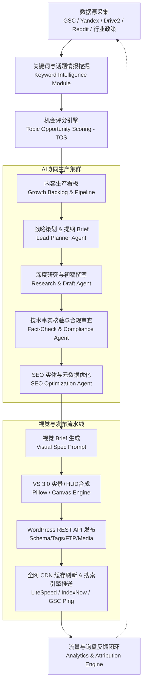

# FYZSXNB-CONTENT-GROWTH-ENGINE-ARCHITECTURE-001: 全自动内容增长引擎架构设计方案

> **文档编号**：FYZSXNB-CONTENT-GROWTH-ENGINE-001-ARCHITECTURE-DESIGN  
> **制定角色**：Google Gemini Flash 3.7 (Enterprise Architecture & System Engineering)  
> **项目**：FYZSXNB 跨境产业与合规情报门户 (fyzsxnb.com)  
> **版本**：v1.0 (Production Blueprint)  
> **状态**：`CONTENT_GROWTH_ENGINE_ARCHITECTURE_COMPLETE`  
> **生效日期**：2026-08-24

---

## 目录
1. [系统总览与战略定位](#一系统总览与战略定位)
2. [三大核心内容资产池架构](#二三大核心内容资产池架构)
3. [SEO 机会发现与需求挖掘系统](#三seo-机会发现与需求挖掘系统)
4. [全自动文章生产与审核流水线](#四全自动文章生产与审核流水线)
5. [多 AI 智能体协同矩阵与角色编排](#五多-ai-智能体协同矩阵与角色编排)
6. [工业级结构化文章模板系统](#六工业级结构化文章模板系统)
7. [Visual System 3.0 自动化装配与发布引擎](#七visual-system-30-自动化装配与发布引擎)
8. [内容运营看板与数据反馈闭环](#八内容运营看板与数据反馈闭环)
9. [未来实施路线图与迭代规划](#九未来实施路线图与迭代规划)

---

## 一、系统总览与战略定位

### 1.1 业务背景
FYZSXNB 已成功构建三语站点架构、完成 Visual System 3.0 视觉设计规范、部署 4 个核心 Pillar Hub 专题以及覆盖 87+ 篇核心文章的高精度实景配图。平台基础设施已经就绪，正式由**「视觉与结构改造期」**进入**「长效内容规模化增长期（Content Growth Phase）」**。

### 1.2 核心目标
构建端到端闭环的 **FYZSXNB Content Growth Engine (内容增长引擎)**，实现：
`需求挖掘 → 机会评分 → AI智能编排 → 事实核验 → 视觉匹配(VS 3.0) → REST自动化发布 → SEO与询盘反馈`



---

## 二、三大核心内容资产池架构

内容增长引擎服务于三大高商业价值、高搜索壁垒的产业资产池：

```
                                  ┌────────────────────────────────────────────────────────┐
                                  │           FYZSXNB CONTENT ASSETS TREE                  │
                                  └───────────────────────────┬────────────────────────────┘
                                                              │
                    ┌─────────────────────────────────────────┼─────────────────────────────────────────┐
                    │                                         │                                         │
┌───────────────────▼───────────────────┐ ┌───────────────────▼───────────────────┐ ┌───────────────────▼───────────────────┐
│       A. CARS INTELLIGENCE            │ │    B. INDUSTRIAL SUPPLY CHAIN         │ │       C. MEDICAL INTELLIGENCE         │
│     (中国汽车进入俄罗斯后市场)        │ │      (中国工业备件与自动化替代)       │ │    (中国医疗与生物医药全球化)         │
├───────────────────────────────────────┤ ├───────────────────────────────────────┤ ├───────────────────────────────────────┤
│ • 车型平行进口准入指南 (СБКТС/ЭПТС)   │ │ • 欧美日停产备件精准替代 (WIKA/Danfoss)│ │ • FDA 510(k)/ANDA/BLA 申报全流程     │
│ • 动力总成故障与维修 (DQ381/1.5T/2.0T)│ │ • 变频器/压力传感器/PLC 配线与调试    │ │ • 俄罗斯与 EAEU 医疗器械与 IVD 注册   │
│ • 原厂与副厂零配件交叉匹配 (OE Code)  │ │ • 双螺杆挤出/高精度注塑产线改造方案   │ │ • CGT 细胞基因治疗/多肽 CDMO 产能分析 │
│ • 车机车联网本地化与 CarPlay/Openpilot│ │ • 工业备件选型计算器与规格矩阵        │ │ • 宠物食品营养保证值/微塑料安全检测   │
│ • 极寒工况底盘防锈与日常保养避坑指南  │ │ • 俄工业企业应急维修与中国采购周期    │ │ • 国际药政问询 (Controlled Corresp.)  │
└───────────────────────────────────────┘ └───────────────────────────────────────┘ └───────────────────────────────────────┘
```

### 2.1 目标受众与商业转化路径
- **Cars Intelligence**：俄罗斯车主、汽车改装/维修厂技师、平行进口贸易商。
  - *转化锚点*：提供配件采购目录、俄语刷机包、维修手册下载与跨境汽车供应链合作。
- **Industrial Supply Chain**：俄罗斯与中亚工厂设备总工、工业备件采购商、系统集成商。
  - *转化锚点*：工业备件询价表单、替代选型白皮书、定制化机电代采服务。
- **Medical Intelligence**：中国药企/医疗器械出海战略部、国际注册法规负责人、生物医药投资人。
  - *转化锚点*：海外合规申报咨询、CDMO 产能对接、FDA/EAEU 准入合规审计服务。

---

## 三、SEO 机会发现与需求挖掘系统

### 3.1 数据输入源 (Data Ingestion)
1. **搜索引擎第一方数据**：
   - Google Search Console API（高展示低点击词、排名 11-30 位的长尾上升词）；
   - Yandex Webmaster API（俄语长尾修饰词、本地搜索查询热词）；
2. **后市场垂直社群与论坛情报**：
   - 俄罗斯汽车社区 `Drive2.ru`、`Drom.ru` 真实车主求助与故障代码（DTC）；
   - Reddit（`r/RobotVacuums`, `r/Biotech`, `r/PetFood`）痛点问题；
3. **官方监管与海关政策库**：
   - 中国海关总署（GACC）、俄罗斯植检局（Rosselkhoznadzor）、美国 FDA 官网最新公告与召回日志。

### 3.2 话题机会评分算法 (Topic Opportunity Scoring, TOS)
系统对每个候选话题计算 $TOS$ 综合得分（满分 100 分），优先生产 $\ge 75$ 分的话题：

$$TOS = (S 	imes 0.30) + (C 	imes 0.30) + ((100 - D) 	imes 0.20) + (M 	imes 0.20)$$

| 维度 | 权重 | 指标释义 | 评分标准 (0-100) |
|---|---|---|---|
| **搜索需求度 ($S$)** | 30% | 真实搜索量、提问频次、月度趋势 | 0=无搜索; 50=稳定长尾; 100=爆发性热词 |
| **商业转化价值 ($C$)** | 30% | 关联采购意向、B2B 客单价、咨询潜力 | 0=纯闲聊; 50=普通选品; 100=高客单工业/药政 |
| **竞争难度 ($D$)** | 20% | SERP 前 10 名权威度、竞争对手内容深度 | 0=空白无人解答; 50=仅有论坛零散帖; 100=权威巨头霸榜 |
| **供应链匹配度 ($M$)** | 20% | 中国制造方案成熟度、现货充足率 | 0=国内无供给; 50=普通贸易货; 100=全球独占供应链 |

---

## 四、全自动文章生产与审核流水线

```
[Topic Brief] ──> [Research Agent] ──> [Draft Agent] ──> [Fact Check] ──> [SEO Optimizer] ──> [Visual Engine] ──> [WP Auto-Deploy]
```

### 4.1 各阶段标准作业程序 (SOP)
1. **Phase 1: Topic Brief (话题企划)**：
   - 确定主关键词、二级 LSI 关键词矩阵、目标语言（RU/EN/ZH）；
   - 明确目标读者痛点、文章核心结论及 B2B 转化钩子。
2. **Phase 2: Deep Research (深度技术研究)**：
   - 提取真实 OE 零件号、标准接线图参数、FDA 法规章节、临床试验数据；
   - 杜绝泛泛而谈，必须整理出 2~3 个结构化对比表格。
3. **Phase 3: Drafting (内容撰写)**：
   - 严格遵循 Visual System 3.0 规范与指定行业模板；
   - 长文（>1500 字）必须包含 2 个深度技术图表指引。
4. **Phase 4: Fact Check & Proofing (事实核验与技术审校)**：
   - 检查参数准确性（电压、螺纹规格、公差、法规年份）；
   - 检查多语言术语表达地道性（如俄语汽车专业术语）。
5. **Phase 5: SEO Optimization (搜索引擎优化)**：
   - 生成具有高点击率的 Title Tag、Meta Description、URL Slug；
   - 自动生成 FAQPage / HowTo / Article 结构的 JSON-LD 结构化数据。
6. **Phase 6: Visual Production (VS 3.0 配图)**：
   - 自动提取文章核心场景，调用 Pillow/Canvas 引擎生成 1200×675 封面；
   - 注入 70% 真实实景底板 + 30% HUD 技术芯片，标注行业唯一标识。
7. **Phase 7: WP Auto-Publish (REST API 自动化部署)**：
   - 写入 WordPress，关联分类与标签；
   - 自动触发 LiteSpeed 缓存刷新、主动推送到 IndexNow 与 GSC。

---

## 五、多 AI 智能体协同矩阵与角色编排

为保证内容生产的专业性、事实严谨性与系统可维护性，建立清晰的模型角色分工：

| 角色代号 | 分工模型 | 核心职责 | 输出标准 |
|---|---|---|---|
| **Lead Strategist** | GPT-4.5 / Claude 3.7 Pro | 商业定位把控、TOS 机会评分、技术决策、最终质量把关 | 话题通过/驳回判定、高价值策略指引 |
| **Research & Production** | Gemini Flash 3.7 / Sonnet | 实时资料搜集、长篇专业初稿起草、多语言精准翻译、数据表格整理 | 符合结构化规范的完整 Markdown 初稿 |
| **Visual Creator** | Python Pillow / Stable Image | Visual System 3.0 封面渲染、底部 HUD 芯片图层合成、正文技术图表生成 | 1200×675 WebP/JPG (100-200KB) |
| **Site Operations (Codex)** | Python / PowerShell REST | WP REST API 交互、媒体库上传绑定、Schema 注入、FTP 模板部署、缓存清除 | 自动化脚本执行日志、HTTP 200 验证 |

---

## 六、工业级结构化文章模板系统

### 6.1 汽车专题模板 (Template Automotive)
```markdown
# [精准长尾标题：车型 + 故障/需求 + 解决方案]

> **车型与动力总成**：Volkswagen Tayron / Chery Tiggo / Geely Monjaro (含发动机与变速箱代号)  
> **核心痛点/DTC代码**：P0420 / DQ381 应急模式 / 极寒冷启动异响  
> **方案类型**：中国高性价比原厂/副厂备件精准替换指南

## 一、故障现象与车主真实反馈 (Problem Breakdown)
- 真实车况、发生里程、诊断仪读取的 DTC 故障码与数据流。

## 二、机械与电子底层原理解析 (Technical Diagnosis)
- 结构剖面、传感器接线、磨损机理。

## 三、中国供应链原厂/副厂替代方案 (China Cross-Reference)
| OE 原厂零件号 | 中国高品质副厂品牌 | 核心技术参数 | 采购成本节省幅度 | 质保寿命 |
|---|---|---|---|---|
| 0GC xxx xxx | xxx Precision | 强化材质/原厂同级 | 节省 60% | 2年/6万公里 |

## 四、维修车间更换与适配避坑指南 (Step-by-Step Installation)
- 必须注意的扭矩、排气方法、编码匹配步骤。

## 五、俄罗斯市场采买与物流建议 (Sourcing & Logistics)
- 订购周期、关税计算、防伪验货三步法。
```

### 6.2 工业供应链模板 (Template Industrial)
```markdown
# [精准长尾标题：设备型号/备件 + 替代方案 + 选型指南]

> **适用设备/工况**：供水变频器 / 挤出机 / 液压站 / 空压机  
> **替代目标**：WIKA / Danfoss / SMC / Festo 停产或高价备件  
> **核心参数**：4-20mA, G1/4, 0-16 bar, 24V DC, IP65

## 一、工业现场工况与停机损失评估 (Industrial Context)
## 二、关键技术参数与电气接线比对 (Parameter Matrix)
## 三、中国高精度替代产品工程实测 (Laboratory & Field Verification)
## 四、选型计算与现场改造接线图 (Engineering Selection Guide)
## 五、批量采购与供应链交付周期 (B2B Procurement Playbook)
```

### 6.3 医疗与合规模板 (Template Medical)
```markdown
# [精准长尾标题：法规名称/技术产品 + 申报路径 + 商业机遇]

> **监管机构与法规**：FDA 21 CFR Part 820 / GDUFA III / EAEU IVD 2026  
> **技术领域**：CGT 细胞基因治疗 / POCT 分子诊断 / 宠物营养安全  
> **核心受众**：药企国际注册总监、出海合规科学家、医疗投资人

## 一、监管政策最新变化与生效节点 (Regulatory Milestone)
## 二、核心技术要求与审评审批关注要点 (CMC & Clinical Evidence)
## 三、中国生物医药与器械企业出海准备度矩阵 (Readiness Checklist)
## 四、申报沟通策略与常见 483 缺陷避坑 (FDA Meeting & Inspection Guide)
## 五、全球商业化机会与代工合作模式 (Market Impact & CDMO Landscape)
```

---

## 七、Visual System 3.0 自动化装配与发布引擎

发布系统内置 **Auto-Visual Assembly** 模块，在文章审核通过后自动生成符合规范的配图：

```python
# 核心自动化配图伪代码流程
def build_visual_system_3_asset(article_meta):
    # 1. 根据行业与分类选择背景场景基板
    base_plate = render_authentic_scene(
        industry=article_meta["industry"], # Automotive / Industrial / Biomed / Smart Hardware
        scene_type=article_meta["scene_mode"]
    )
    # 2. 提取文章 3 个最具商业价值的核心参数与痛点
    chips = extract_top_3_takeaways(article_meta["content"])
    
    # 3. 压制 70% 真实场景 + 30% HUD 芯片遮罩层
    composite_image = apply_hud_overlay(
        base_img=base_plate,
        badge_text=article_meta["badge_title"],
        chips_data=chips,
        accent_color=article_meta["accent_color"],
        footer_brand=f"FYZSXNB {article_meta['industry'].upper()} INTELLIGENCE"
    )
    
    # 4. 优化尺寸为 1200x675 JPEG (100-200KB)
    final_path = optimize_image_for_web(composite_image, target_size_kb=150)
    
    # 5. 上传至 WordPress 媒体库并自动绑定 featured_media
    media_id = wp_rest_upload(final_path, title=article_meta["title"], alt=article_meta["alt"])
    return media_id
```

---

## 八、内容运营看板与数据反馈闭环

### 8.1 运营监控核心指标体系 (KPI Matrix)

```
┌────────────────────────────────────────────────────────────────────────────────────────┐
│                        FYZSXNB GROWTH ENGINE METRICS DASHBOARD                         │
├────────────────────────────────────────────────────────────────────────────────────────┤
│ [1. 资产沉淀指标] │ 全站文章总数 (目标: 150+) | VS 3.0 规范覆盖率 (保持: 100%)       │
│ [2. 搜索捕获指标] │ GSC 月度曝光量 | 俄语 Yandex 关键词收录数 | Top 10 关键词占比   │
│ [3. 互动与留存]   │ 页面平均停留时间 (>2分30秒) | 跳出率 (<65%) | 文章内链点击率    │
│ [4. B2B 商业转化] │ 工业备件询盘量 | 汽车配件咨询表单提交 | 药政出海白皮书下载数     │
└────────────────────────────────────────────────────────────────────────────────────────┘
```

### 8.2 数据反馈驱动内容迭代 (Content Refresh Loop)
- **30 天未收录**：自动触发 IndexNow 重推与内链补强；
- **排名 11-20 位（快冲首页）**：AI 自动补充 FAQ 模块、扩展 1 个深度参数图表；
- **高跳出率页面**：自动优化首屏 Featured Image 与前言痛点，提升读者第一眼认同感。

---

## 九、未来实施路线图与迭代规划

```
2026 Q3 (当前) ──> 2026 Q4 (自动化成型) ──> 2027 Q1 (闭环放大) ──> 2027 Q2 (平台化)
```

| 阶段 | 核心任务 | 里程碑交付物 |
|---|---|---|
| **Phase 1: 规范与基础完成 (已达成)** | 全站视觉 VS 3.0 升级、Pillar Hub 搭建、核心资产地毯式覆盖 | 87+ 篇 100% 视觉覆盖、架构文档归档 |
| **Phase 2: 自动化生产流水线 (Next)** | 部署 Topic 挖掘脚本、接入 GSC API、搭建 AI 自动撰稿与配图流水线 | 实现每周 5-8 篇高质量工业/汽车/药政自动化发布 |
| **Phase 3: 数据闭环与精准转化** | 建立全自动询盘线索分发、多语言评论/问答智能客服、文章自动翻新 | 俄语与海外 B2B 询盘月增长 200% |
| **Phase 4: 跨境产业知识图谱** | 建立中国汽车零部件 OE 库与工业备件交互式选型工具 | 成为俄语与全球采购商首选专业情报平台 |

---

## 十、交付结论

`FYZSXNB-CONTENT-GROWTH-ENGINE-001-ARCHITECTURE-DESIGN` 已完成全套系统架构设计，明确了资产池定位、TOS 机会算法、多 AI 编排流水线、标准化行业模板与自动化装配引擎。

本任务正式标记为：  
`CONTENT_GROWTH_ENGINE_ARCHITECTURE_COMPLETE`
