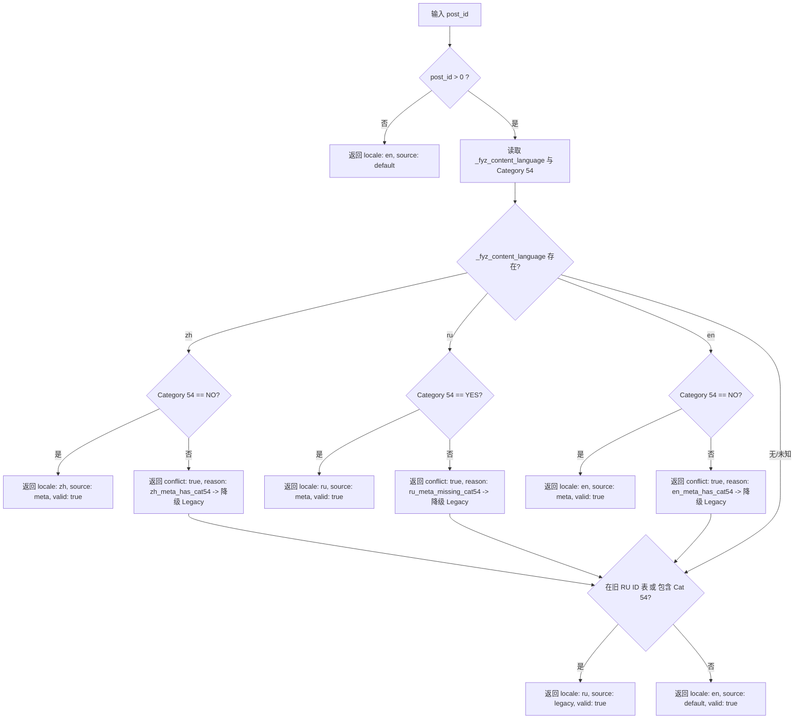

# FYZSXNB Language Contract V2 — Local Implementation & Deployment Plan

**Document ID:** `FYZ-DOC-20260820-IMPL-PLAN-044`  
**Stage:** `0.4.4`  
**Author:** Google Gemini Flash 3.7  
**Scope:** Engineering Specification, Code Architecture, and Step-by-Step Deployment Protocol  

---

## 1. 架构目标与范围定义 (Scope Definition)

### 1.1 允许修改范围 (Allowed Scope)
1. **发布元数据契约（Publishing Metadata Contract）**：
   - 扩展 `_fyz_content_language` 支持 `['en', 'ru', 'zh']`；
   - 后台 Meta Box 增加 Chinese (`zh`) 单选选项；
   - 发布脚本 `publish_single_article.py` 增加 `zh` 选项支持。
2. **Feed 插件（Feed Plugin v1.2.5）**：
   - 增加 `zh-CN` locale 解析支持；
   - 维持现行 EN / RU 首页 Feed 绝对正向白名单匹配，严防中文泄漏。
3. **MU-Plugin SEO 补丁（v1.5.0）**：
   - 升级 `fyzsxnb_resolve_content_locale()` 为 V2 三元解析器；
   - 对 `zh` 内容输出 `lang="zh-CN"`、`og:locale="zh_CN"`、Schema `inLanguage="zh-CN"`。

### 1.2 严禁触碰范围 (Forbidden Scope)
- **禁止**修改主题代码及模板结构（Neve Child 0.3.11 保持冻结）；
- **禁止**修改既有 Canonical 逻辑（保持 Self-Canonical 铁律）；
- **禁止**修改首页 Hreflang 配对（Page 11 ↔ Page 400 保持现状）；
- **禁止**触碰 Robots、Sitemap、URL 结构及固定链接；
- **禁止**触碰 CFC（Cars from China）矩阵与 Translation Pair 运行时。

---

## 2. Resolver V2 详细设计规范 (Resolver V2 Design)

### 2.1 函数签名与数据结构
```php
/**
 * Resolve content locale for single post object under Language Contract V2.
 *
 * @param int $post_id Post ID.
 * @return array {
 *     @type string $locale     'en'|'ru'|'zh' (normalized ISO language code)
 *     @type string $source     'meta'|'legacy'|'default'
 *     @type string $confidence 'high'|'fallback'|'default'
 *     @type bool   $valid      True when structural contract is satisfied
 *     @type bool   $conflict   True when metadata and category contradict
 *     @type string $reason     Detailed reason code for conflict or fallback
 * }
 */
function fyzsxnb_resolve_content_locale( $post_id )
```

### 2.2 决策流与降级层级 (Decision Hierarchy)



---

## 3. 发布契约与后台 Meta Box V2 规范 (Publishing Contract V2)

1. **零历史污染**：
   - 现网已有的 58 篇 `en` 与 25 篇 `ru` 文章完全处于合规状态，**无需任何字段迁移**。
2. **后台交互升级**：
   - Meta box 渲染 3 个单选语言选项：`English (en)`、`Russian (ru)`、`Chinese (zh)`。
   - 维持发布强校验阻断：`status=publish` 且未勾选语言或内容类型时，自动降级为 `pending` 并展示显式红字提示。
3. **结构门禁提示**：
   - 若勾选 `zh` 或 `en` 但文章被打上 Category 54（Russian Library），编辑器界面展示黄色警告提示。

---

## 4. 实施与发布五阶段路线图 (Deployment Protocol)

```text
+-------------------------------------------------------------------------------+
| Stage A: 本地代码实现 (Local Implementation)                                  |
|   - 插件/MU-Plugin/发布脚本本地打补丁，运行 PHP Lint 确保 0 语法错误           |
+-------------------------------------------------------------------------------+
| Stage B: 离线与单元测试 (Offline QA & Synthetic Test)                          |
|   - 运行 25+ 项合成测试 (Cases EN, RU, ZH, Fallback, Conflict, Feed Isolation) |
|   - 生成全量 Parity 矩阵，确认现有 96 篇输出 100% 逐位一致                      |
+-------------------------------------------------------------------------------+
| Stage C: 生产代码安全部署 (Plugin/MU-Plugin Deployment)                       |
|   - 执行生产 Guard 检查 -> 全量备份快照 -> FTP 部署插件与 MU-plugin              |
|   - 只读验证公网 HTTP 200 与 0 回退 (生产文章元数据此时保持原样)                |
+-------------------------------------------------------------------------------+
| Stage D: 小批次中文资产确权 (Small Batch ZH Migration)                        |
|   - 第一批：对 Level A 证据双全的 Post 479 与 Post 470 写入 zh/kind 元数据    |
|   - 读回验证 -> 验证 EN/RU 首页 Feed 零泄漏 -> 验证 479/470 输出 lang=zh-CN     |
|   - 第二批：根据后续指令推进剩余 8 篇中文文章                                   |
+-------------------------------------------------------------------------------+
| Stage E: 紧急回滚机制 (Emergency Rollback)                                    |
|   - 若发生任何异常，立即恢复本地备份快照，逆序回滚                               |
+-------------------------------------------------------------------------------+
```
